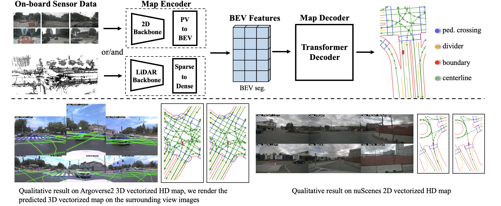

<div align="center">
<h1>MapTR </h1>
<h3>An End-to-End Framework for Online Vectorized HD Map Construction</h3>

[Bencheng Liao](https://github.com/LegendBC)<sup>1,2,3</sup> \*, [Shaoyu Chen](https://scholar.google.com/citations?user=PIeNN2gAAAAJ&hl=en&oi=sra)<sup>1,3</sup> \*, Yunchi Zhang<sup>1,3</sup> \*, [Bo Jiang](https://github.com/rb93dett)<sup>1,3</sup> \*,[Tianheng Cheng](https://scholar.google.com/citations?user=PH8rJHYAAAAJ&hl=zh-CN)<sup>1,3</sup>, [Qian Zhang](https://scholar.google.com/citations?user=pCY-bikAAAAJ&hl=zh-CN)<sup>3</sup>, [Wenyu Liu](http://eic.hust.edu.cn/professor/liuwenyu/)<sup>1</sup>, [Chang Huang](https://scholar.google.com/citations?user=IyyEKyIAAAAJ&hl=zh-CN)<sup>3</sup>, [Xinggang Wang](https://xinggangw.info/)<sup>1 :email:</sup>
 
<sup>1</sup> School of EIC, HUST, <sup>2</sup> Institute of Artificial Intelligence, HUST, <sup>3</sup> Horizon Robotics

(\*) equal contribution, (<sup>:email:</sup>) corresponding author.

ArXiv Preprint ([arXiv 2208.14437](https://arxiv.org/abs/2208.14437))

[openreview ICLR'23](https://openreview.net/forum?id=k7p_YAO7yE), accepted as **ICLR Spotlight**

extended ArXiv Preprint MapTRv2 ([arXiv 2308.05736](https://arxiv.org/abs/2308.05736))

</div>

#
### News
* **`Aug. 31th, 2023`:** initial MapTRv2 is released at ***maptrv2*** branch. Please run `git checkout maptrv2` to use it.
* **`Aug. 14th, 2023`:** As required by many researchers, the code of MapTR-based map annotation framework (VMA) will be released at https://github.com/hustvl/VMA recently.
* **`Aug. 10th, 2023`:** We release [MapTRv2](https://arxiv.org/abs/2308.05736) on Arxiv. MapTRv2 demonstrates much stronger performance and much faster convergence. To better meet the requirement of the downstream planner (like [PDM](https://github.com/autonomousvision/nuplan_garage)), we introduce an extra semantic——centerline (using path-wise modeling proposed by [LaneGAP](https://github.com/hustvl/LaneGAP)). Code & model will be released in late August. Please stay tuned!
* **`May. 12th, 2023`:** MapTR now support various bevencoder, such as [BEVFormer encoder](projects/configs/maptr/maptr_tiny_r50_24e_bevformer.py) and [BEVFusion bevpool](projects\configs\maptr\maptr_tiny_r50_24e_bevpool.py). Check it out!
* **`Apr. 20th, 2023`:** Extending MapTR to a general map annotation framework ([paper](https://arxiv.org/pdf/2304.09807.pdf), [code](https://github.com/hustvl/VMA)), with high flexibility in terms of spatial scale and element type.
* **`Mar. 22nd, 2023`:** By leveraging MapTR, VAD ([paper](https://arxiv.org/abs/2303.12077), [code](https://github.com/hustvl/VAD))  models the driving scene as fully vectorized representation, achieving SoTA end-to-end planning performance!
* **`Jan. 21st, 2023`:** MapTR is accepted to ICLR 2023 as **Spotlight Presentation**!
* **`Nov. 11st, 2022`:** We release an initial version of MapTR.
* **`Aug. 31st, 2022`:** We released our paper on Arxiv. Code/Models are coming soon. Please stay tuned! ☕️


## Introduction
<div align="center"><h4>MapTR/MapTRv2 is a simple, fast and strong online vectorized HD map construction framework.</h4></div>



High-definition (HD) map provides abundant and precise static environmental information of the driving scene, serving as a fundamental and indispensable component for planning in autonomous driving system. In this paper, we present **Map** **TR**ansformer, an end-to-end framework for online vectorized HD map construction. We propose a unified permutation-equivalent modeling approach, i.e., modeling map element as a point set with a group of equivalent permutations, which accurately describes the shape of map element and stabilizes the learning process. We design a hierarchical query embedding scheme to flexibly encode structured map information and perform hierarchical bipartite matching for map element learning. To speed up convergence, we further introduce auxiliary one-to-many matching and dense supervision. The proposed method well copes with various map elements with arbitrary shapes. It runs at real-time inference speed and achieves state-of-the-art performance on both nuScenes and Argoverse2 datasets. Abundant qualitative results show stable and robust map construction quality in complex and various driving scenes.

## Models
> Results from the [MapTRv2 paper](https://arxiv.org/abs/2308.05736)


| Method | Backbone | Lr Schd | mAP| FPS|
| :---: | :---: | :---: | :---: | :---: 
| MapTR | R18 | 110ep | 45.9 | 35.0| 
| MapTR | R50 | 24ep | 50.3 | 15.1| 
| MapTR | R50 | 110ep | 58.7|15.1|
| MapTRv2 | R18 | 110ep | 52.3 | 33.7|
| MapTRv2 | R50 | 24ep | 61.5 | 14.1|
| MapTRv2 | R50 | 110ep | 68.7 | 14.1|
| MapTRv2 | V2-99 | 110ep | 73.4 | 9.9|

**Notes**: 

- FPS is measured on NVIDIA RTX3090 GPU with batch size of 1 (containing 6 view images).
- All the experiments are performed on 8 NVIDIA GeForce RTX 3090 GPUs. 

> Results from this repo. 

### MapTR

<div align="center"><h4> nuScenes dataset</h4></div>

| Method | Backbone | BEVEncoder |Lr Schd | mAP| FPS|memory | Config | Download |
| :---: | :---: | :---: | :---: |  :---: | :---:|:---:| :---: | :---: |
| MapTR-nano | R18 |GKT | 110ep |46.3  |35.0| 11907M (bs 24) |[config](projects/configs/maptr/maptr_nano_r18_110e.py) |[model](https://drive.google.com/file/d/1-wVO1pZhFif2igJoz-s451swQvPSto2m/view?usp=sharing) / [log](https://drive.google.com/file/d/1Hd25seDQKn8Vv6AQxPfSoiu-tY2i4Haa/view?usp=sharing) |
| MapTR-tiny | R50 | GKT |24ep | 50.0 |15.1| 10287M (bs 4) | [config](projects/configs/maptr/maptr_tiny_r50_24e.py)|[model](https://drive.google.com/file/d/1n1FUFnRqdskvmpLdnsuX_VK6pET19h95/view?usp=share_link) / [log](https://drive.google.com/file/d/1nvPkk0EMHV8Q82E9usEKKYx7P38bCx1U/view?usp=share_link) |
| MapTR-tiny | R50 |GKT | 110ep | 59.3 |15.1| 10287M (bs 4)|[config](projects/configs/maptr/maptr_tiny_r50_110e.py) |[model](https://drive.google.com/file/d/1SCF93LEEmXU0hMwPiUz9p2CWbL1FpB1h/view?usp=share_link) / [log](https://drive.google.com/file/d/1TQ4j_0Sf2ipzeYsEZZAHYzX4dCUaBqyp/view?usp=share_link) |
| MapTR-tiny | Camera & LiDAR | GKT |24ep | 62.7 | 6.0 | 11858M (bs 4)|[config](projects/configs/maptr/maptr_tiny_fusion_24e.py) |[model](https://drive.google.com/file/d/1CFlJrl3ZDj3gIOysf5Cli9bX5LEYSYO4/view?usp=share_link) / [log](https://drive.google.com/file/d/1rb3S4oluxdZjNm2aJ5lBH23jrkYIaJbC/view?usp=share_link) |
| MapTR-tiny | R50 | bevpool |24ep | 50.1 | 14.7 | 9817M (bs 4)|[config](projects/configs/maptr/maptr_tiny_r50_24e_bevpool.py) |[model](https://drive.google.com/file/d/16PK9XohV55_3qPVDtpXIl4_Iumw9EnfA/view?usp=sharing) / [log](https://drive.google.com/file/d/14nioV3_VV9KehmxK7XcAHxM8X6JH5WIr/view?usp=sharing) |
| MapTR-tiny | R50 | bevformer |24ep | 48.7 | 15.0 | 10219M (bs 4)|[config](projects/configs/maptr/maptr_tiny_r50_24e_bevformer.py) |[model](https://drive.google.com/file/d/1y-UBwGBSb2xiV40AuQEBhB-xJyV7VusX/view?usp=sharing) / [log](https://drive.google.com/file/d/1r35bRhTGVtyZTP8drXBTOIhLYGCzjEaF/view?usp=sharing) |

### MapTRv2
Please `git checkout maptrv2` and follow the install instruction to use following checkpoint

<div align="center"><h4> nuScenes dataset</h4></div>

| Method | Backbone | BEVEncoder |Lr Schd | mAP| FPS|memory | Config | Download |
| :---: | :---: | :---: | :---: |  :---: | :---:|:---:| :---: | :---: |
| MapTRv2| R50 |bevpool | 24ep | WIP |14.1| WIP (bs 24) |[config](https://github.com/hustvl/MapTR/blob/maptrv2/projects/configs/maptrv2/maptrv2_nusc_r50_24ep.py) |model / log |
| MapTRv2*| R50 |bevpool | 24ep | WIP |WIP| WIP (bs 24) |[config](https://github.com/hustvl/MapTR/blob/maptrv2/projects/configs/maptrv2/maptrv2_nusc_r50_24ep_w_centerline.py) |model / log |


<div align="center"><h4> Argoverse2 dataset</h4></div>

**Notes**: 

- \* means that we introduce an extra semantic——centerline (using path-wise modeling proposed by [LaneGAP](https://github.com/hustvl/LaneGAP)).

## Qualitative results on nuScenes val split and Argoverse2 val split

<div align="center"><h4> MapTR/MapTRv2 maintains stable and robust map construction quality in various driving scenes.</h4></div>


### *MapTRv2 on whole nuScenes val split*
[**Youtube**](https://www.youtube.com/watch?v=s7McToPNlJ4)

### *MapTRv2 on whole Argoverse2 val split*
[**Youtube**](https://www.youtube.com/watch?v=nC8W_2BZuys)

<!-- ### *Sunny&Cloudy*
https://user-images.githubusercontent.com/31960625/187059686-11e4dd4b-46db-4411-b680-17ed6deebda2.mp4

### *Rainy*
https://user-images.githubusercontent.com/31960625/187059697-94622ddb-e76a-4fa7-9c44-a688d2e439c0.mp4

### *Night*
https://user-images.githubusercontent.com/31960625/187059706-f7f5a7d8-1d1d-46e0-8be3-c770cf96d694.mp4 -->

### *End-to-end Planning based on MapTR*
https://user-images.githubusercontent.com/26790424/229679664-0e9ba5e8-bf2c-45e0-abbc-36d840ee5cc9.mp4


## Getting Started
- [Installation](docs/install.md)
- [Prepare Dataset](docs/prepare_dataset.md) (Notes: annotation generation of MapTRv2 is different from MapTR )
- [Train and Eval](docs/train_eval.md)
- [Visualization](docs/visualization.md)


## Catalog

- [ ] centerline detection & topology support
- [x] multi-modal checkpoints
- [x] multi-modal code
- [ ] lidar modality code
- [x] argoverse2 dataset 
- [x] Nuscenes dataset 
- [x] MapTR checkpoints
- [x] MapTR code
- [x] Initialization

## Acknowledgements

MapTR is based on [mmdetection3d](https://github.com/open-mmlab/mmdetection3d). It is also greatly inspired by the following outstanding contributions to the open-source community: [BEVFusion](https://github.com/mit-han-lab/bevfusion), [BEVFormer](https://github.com/fundamentalvision/BEVFormer), [HDMapNet](https://github.com/Tsinghua-MARS-Lab/HDMapNet), [GKT](https://github.com/hustvl/GKT), [VectorMapNet](https://github.com/Mrmoore98/VectorMapNet_code).

## Citation
If you find MapTR is useful in your research or applications, please consider giving us a star 🌟 and citing it by the following BibTeX entry.
```bibtex
@inproceedings{MapTR,
  title={MapTR: Structured Modeling and Learning for Online Vectorized HD Map Construction},
  author={Liao, Bencheng and Chen, Shaoyu and Wang, Xinggang and Cheng, Tianheng, and Zhang, Qian and Liu, Wenyu and Huang, Chang},
  booktitle={International Conference on Learning Representations},
  year={2023}
}
```
```bibtex
@inproceedings{MapTRv2,
  title={MapTRv2: An End-to-End Framework for Online Vectorized HD Map Construction},
  author={Liao, Bencheng and Chen, Shaoyu and Zhang, Yunchi and Jiang, Bo and Zhang, Qian and Liu, Wenyu and Huang, Chang and Wang, Xinggang},
  booktitle={arXiv preprint arXiv: 2308.05736},
  year={2023}
}
```
